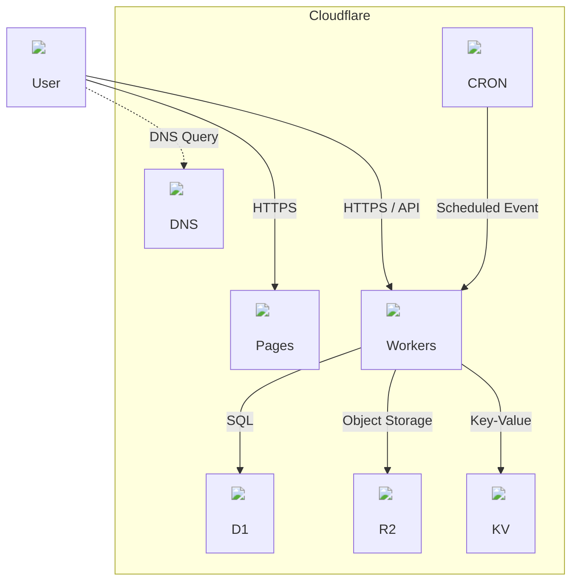

```mermaid
graph TB
    User["<img src='https://cf-icons.pages.dev/internet-browser.svg' width='48'><br/>User"]

    subgraph Cloudflare["Cloudflare"]
        DNS["<img src='https://cf-icons.pages.dev/dns.svg' width='48'><br/>DNS"]
        Pages["<img src='https://cf-icons.pages.dev/pages-logo.svg' width='48'><br/>Pages"]
        Worker["<img src='https://cf-icons.pages.dev/edgeworker.svg' width='48'><br/>Workers"]
        D1["<img src='https://cf-icons.pages.dev/d1.svg' width='48'><br/>D1"]
        R2["<img src='https://cf-icons.pages.dev/r2.svg' width='48'><br/>R2"]
        KV["<img src='https://cf-icons.pages.dev/kv.svg' width='48'><br/>KV"]
        CRON["<img src='https://cf-icons.pages.dev/timer.svg' width='48'><br/>CRON"]
    end

    User -.->|"DNS Query"| DNS
    User --->|"HTTPS"| Pages
    User --->|"HTTPS / API"| Worker

    Worker --->|"SQL"| D1
    Worker --->|"Object Storage"| R2
    Worker --->|"Key-Value"| KV
    CRON --->|"Scheduled Event"| Worker
```
